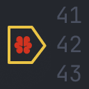

#  Claude Debugs For You


[](https://marketplace.visualstudio.com/items?itemName=JasonMcGhee.claude-debugs-for-you)

### Enable Claude (or any other LLM) to interactively debug your code

This is an [MCP](https://docs.anthropic.com/en/docs/build-with-claude/mcp) Server and VS Code extension which enables claude to interactively debug and evaluate expressions.

That means it should also work with other models / clients etc. but I only demonstrate it with Claude Desktop here.

It's language-agnostic, assuming debugger console support and valid launch.json for debugging in VSCode.

## Getting Started

1. Download the extension from [releases](https://github.com/jasonjmcghee/claude-debugs-for-you/releases/) or [VS Code Marketplace](https://marketplace.visualstudio.com/items?itemName=JasonMcGhee.claude-debugs-for-you)
2. Install the extension
  - If using `.vsix` directly, go to the three dots in "Extensions" in VS Code and choose "Install from VSIX..."
3. Open a project containing a `.vscode/launch.json` with the first configuration setup to debug a specific file with `${file}`.
4. On startup, a popup will show that the debug server started and a path to the node binary
  - This can be disabled in settings (e.g. once you've done it the first time or if you're using /sse)

### If using node process based method (required for Claude Desktop)
5. Copy the path of the node binary to `mcp-debug.js` in the popup


6. Paste the following (BUT UPDATE THE PATH TO THE COPIED ONE!) in your `claude_desktop_config.json` or edit accordingly if you use other MCP servers

```
{
  "mcpServers": {
    "debug": {
      "command": "node",
      "args": [
        "/path/to/mcp-debug.js"
      ]
    }
  }
}
```

7. Start Claude desktop (or other MCP client)
  - Note: You may need to restart it, if it was already running.
  - You can skip this step if using Continue/Cursor or other built-in to VS Code

### If using `/sse` based method (e.g. Cursor)
4. Add the MCP server using the server URL of "http://localhost:4711/sse", or whatever port you setup in settings.
  - You may need to hit "refresh" depending on client: this is required in Cursor
5. Start MCP client
  - Note: You may need to restart it, if it was already running.
  - You can skip this step if using Continue/Cursor or other built-in to VS Code

### You're ready to debug!

See [Run  an Example](#run-an-example) below, and/or watch a demo video.

## Contributing

Find bugs or have an idea that will improve this? Please open a pull request or log an issue.

Does this readme suck? Help me improve it!

## Demo

### Using [Continue](https://github.com/continuedev/continue)

It figures out the problem, and then suggests a fix, which we just click to apply

https://github.com/user-attachments/assets/3a0a879d-2db7-4a3f-ab43-796c22a0f1ef

<details>
  <summary>How do I set this up with Continue? / Show MCP Configuration</summary>

  [Read the docs!](https://docs.continue.dev/customize/tools)

  Configuration:
  
  ```json
  {
    ...
    "experimental": {
      "modelContextProtocolServers": [
        {
          "transport": {
            "type": "stdio",
            "command": "node",
            "args": [
              "/Users/jason/Library/Application Support/Code/User/globalStorage/jasonmcghee.claude-debugs-for-you/mcp-debug.js"
            ]
          }
        }
      ]
    }
  }
  ```

  You'll also need to choose a model capable of using tools.

  When the list of tools pops up, make sure to click "debug" in the list of your tools, and set it to be "Automatic".

  ### Troubleshooting

  If you are seeing MCP errors in continue, try disabling / re-enabling the continue plugin

</details>

If helpful, this is what my configuration looks like! But it's nearly the same as Claude Desktop.


### Using Claude Desktop

In this example, I made it intentionally very cautious (make no assumptions etc - same prompt as below) but you can ask it to do whatever.

https://github.com/user-attachments/assets/ef6085f7-11a2-4eea-bb60-b5a54873b5d5

## Developing

- Clone / Open this repo with VS Code
- Run `npm run install` and `npm run compile`
- Hit "run" which will open a new VSCode
- Otherwise same as "Getting Started applies"
- To rebuild, `npm run compile`

## Package

```bash
vsce package
```


## Run an Example

Open `examples/python` in a VS Code window

Enter the prompt:

```
i am building `longest_substring_with_k_distinct` and for some reason it's not working quite right. can you debug it step by step using breakpoints and evaluating expressions to figure out where it goes wrong? make sure to use the debug tool to get access and debug! don't make any guesses as to the problem up front. DEBUG!
```

## Configuration

There's a hidden env var you can use to set the port on the MCP side.

```
"debug": {
  "command": "node",
  "args": [
    "/path/to/mcp-debug.js"
  ],
  "env": {
    "MCP_DEBUGGER_PORT": 4711
  }
}
```

And similarly you may set the port on the vs code side using extensions settings or JSON:


```
"mcpDebug.port": 4711
```

## Short list of ideas

- [ ] It should use ripgrep to find what you ask for, rather than list files + get file content.
- [x] Add support for conditional breakpoints
- [ ] Add "fix" tool by allowing MCP to insert a CodeLens or "auto fix" suggestion so the user can choose to apply a recommended change or not.
- Your idea here!
